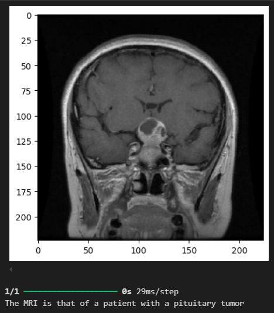

# Brain-Tumor-Dectection
This repository contains code to detect brain tumor from MRI Images using a CNN Architecture.

From an MRI Image, this Deep Learning Solution detects which type of brain tumor the patient has. The types in question are `glioma`, `meningioma` and `pituitary`. If the patient is healthy, it indicated `notumor`.

This is an example of using this solution.
