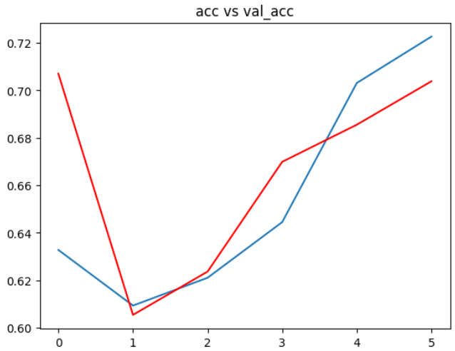
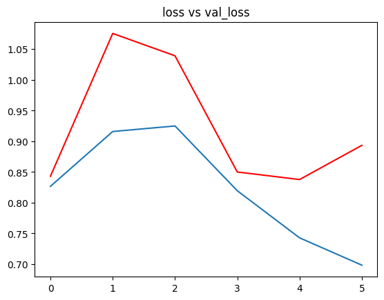
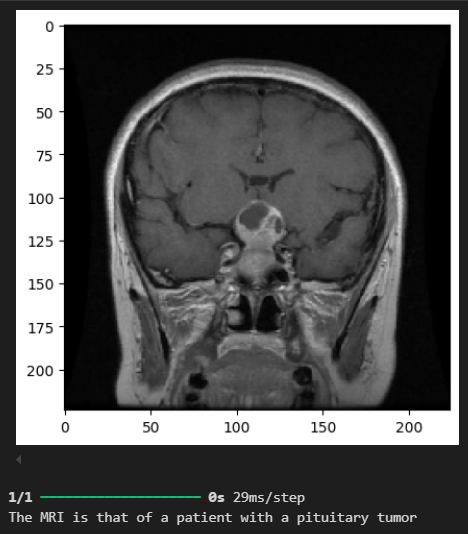

# Brain Tumor Classification using CNN

## Project Overview
This project focuses on classifying brain tumors using Convolutional Neural Networks (CNNs). 
The dataset consists of MRI images categorized into four classes: `Glioma, Meningioma, Pituitary Tumor and No Tumor.` 
The objective is to build a simple deep learning model that can accurately classify MRI scans into these categories.

## Repository Structure
```
├── dataset/
│   ├── Training/   # Contains training images for each class
│   ├── Testing/    # Contains testing images for each class
| model/
│   ├── bestmodel.keras  # Saved best model after training
├── classification.ipynb  # Contains the notebook to run to ensure the classification
├── README.md    # Project Documentation
```

## Prerequisites
Ensure you have the necessary dependencies installed:
```sh
pip install scipy Pillow numpy matplotlib tensorflow keras
```

## Data Overview 
### Dataset Description
The dataset consists of MRI images stored in two directories:
- **Training Set**:
  - `Glioma`: 1321 images
  - `Meningioma`: 1339 images
  - `No Tumor`: 1595 images
  - `Pituitary`: 1457 images
- **Testing Set**:
  - `Glioma`: 300 images
  - `Meningioma`: 306 images
  - `No Tumor`: 405 images
  - `Pituitary`: 300 images

### Data Preprocessing
- **Data Augmentation**: Applied techniques like rescaling, zooming, shearing, and horizontal flipping.
- **Normalization**: Pixel values were scaled to [0,1] for better convergence.

## Model Architecture
The CNN model is built using Keras and TensorFlow with the following layers:
- **Convolutional Layers**: Extract features from MRI images using multiple Conv2D layers with increasing filters.
- **Pooling Layers**: Reduce spatial dimensions and computational cost.
- **Dropout Layers**: Prevent overfitting by randomly dropping neurons.
- **Flatten Layer**: Converts 2D features into a 1D vector.
- **Dense Layers**: Fully connected layers for classification.
- **Softmax Activation**: Outputs probabilities for four classes.

### Model Compilation
- Optimizer: Adam
- Loss Function: Categorical Crossentropy
- Metrics: Accuracy

## Training and Results
### Training Process
- **Early Stopping**: Stops training when validation accuracy does not improve for 5 epochs.
- **Model Checkpoint**: Saves the best model based on validation accuracy.
- **Epochs Trained**: 6 (early stopping triggered)
- **Final Validation Accuracy**: ~68.80%

### Performance Visualization
#### Accuracy vs Validation Accuracy:

`Validation Accuracy` is represented by the red line, while the `Accuracy` is represented by the bleu one.



#### Loss vs Validation Loss

`Validation Loss` is represented by the red line, while the `Loss` is represented by the bleu one.



### Results


## Conclusion
- The CNN model successfully classifies brain tumors with ~68.80% accuracy on the Testing set.
- Future improvements could involve hyperparameter tuning, transfer learning, or using more advanced architectures.